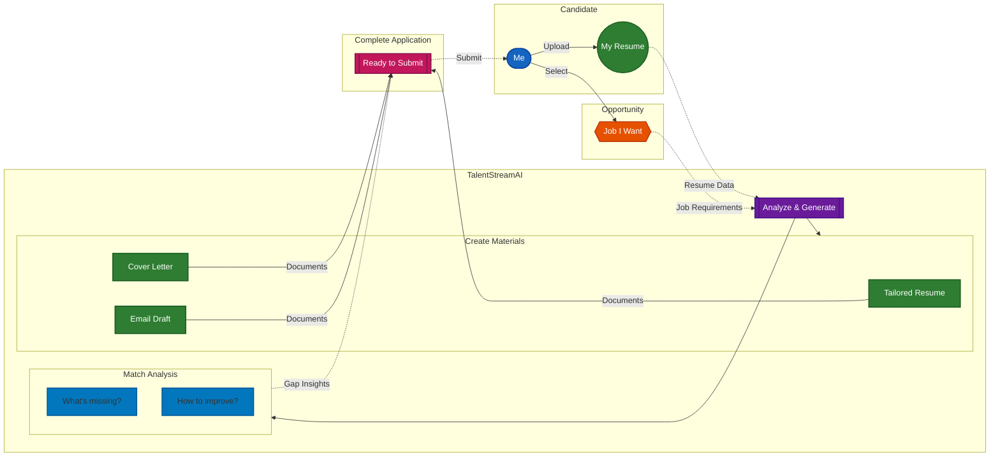
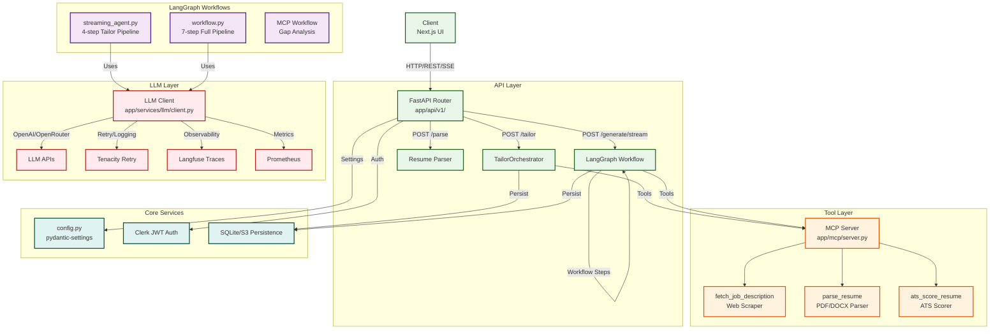

# TalentStreamAI

Squad Five capstone for the Andela AI Engineering Bootcamp. The goal is straightforward on paper: help a candidate move from "I found a role" to "I submitted strong materials" without burning an afternoon on manual rewrites.

## 🎯 Product Direction

- **Ingest** a resume plus a job posting URL or text
- **Diff** the candidate's story against the role (ATS-oriented gap analysis)
- **Generate** refreshed resume copy, a cover letter with narrative structure, and a Gmail-ready draft

## 📊 Product Flow (High Level)



*From your materials and target job, TalentStreamAI identifies gaps, then generates a complete tailored application—ready to submit.*

## 🏗️ Architecture Overview

### System Architecture (Mermaid)



<div align="center"><em>Scroll horizontally to view the full architecture diagram</em></div>

### Backend Structure

```
backend/app/
├── api/                          # HTTP entry points
│   ├── router.py                 # v1 router registration
│   ├── v1/                       # Versioned API
│   │   ├── applications.py       # Tailor endpoint
│   │   ├── generation.py         # Streaming generation (SSE)
│   │   ├── job_descriptions.py   # Job posting fetch/parse
│   │   ├── resumes.py            # Resume management
│   │   ├── profile.py            # User profile
│   │   ├── dashboard.py          # Dashboard stats
│   │   └── auth.py               # Clerk auth integration
│   └── schemas/                  # Pydantic request/response models
│       └── frontend.py
├── core/                         # Shared infrastructure
│   ├── config.py                 # Settings (pydantic-settings)
│   ├── auth.py                   # Clerk JWT verification
│   ├── db.py                     # SQLite (local) / S3 (prod) persistence
│   ├── exception_handlers.py     # Global error handling
│   └── logging_config.py         # Structlog setup
├── mcp/                          # Model Context Protocol server
│   └── server.py                 # MCP tool wrapper + LangGraph adapter
├── services/                     # Business logic & workflows
│   ├── llm/                      # LLM client & utilities
│   │   ├── client.py             # LlmClient (chat_json, retry, metrics)
│   │   ├── safety.py             # Output safety flagging
│   │   ├── json_parsing.py       # JSON→object parsing
│   │   └── schemas.py            # Gap analysis, artifact models
│   ├── langgraph/                # LangGraph workflows
│   │   ├── streaming_agent.py    # Tailor pipeline (stub + LLM modes)
│   │   └── workflow.py           # Full workflow (LangChain)
│   ├── tailor_orchestrator.py    # Orchestrator: job→resume→email
│   ├── resume_weave.py           # Stub-mode keyword weaving
│   └── draft_email.py            # Email draft parsing
└── tools/                        # LangChain tools (invokable)
    ├── job_fetcher.py            # FetchJobDescription tool
    ├── resume_parser.py          # ParseResume tool
    ├── ats_scorer.py             # ATSScorer tool
    └── text_guardrails.py        # NormalizeUserText tool
```

## 🚀 API Endpoints

### Tailor Application (Main Endpoint)

`POST /api/v1/applications/tailor`

Creates a tailored application from a base resume and job description.

**Request Body**:
- `base_resume_id` (str): ID of base resume document (optional if resume provided)
- `job_url` (str, optional): URL of the job posting
- `job_description` (str, optional): Raw job description text

**Response**: `200 OK` - `TailorResponseOut`
- `application_id`: Application record ID
- `match_score`: Match percentage (0-100)
- `resume`: Tailored resume document
- `cover_letter`: Generated cover letter text
- `draft_email`: Gmail draft with subject/body
- `gaps`: Missing keywords and skills
- `analysis`: Original vs tailored score comparison

### Generate Stream

`POST /api/v1/generate/stream`

Server-sent events (SSE) stream for generating tailored resume with gap analysis.

**Request Body**:
- `resume_id` OR `resume_text` (str)
- `job_description_id` OR `job_description_text` (str)

**Stream Events**:
- `gap_analysis`: Keyword/skill gap data
- `resume`: Tailored resume content

### With Missing Skills

`POST /api/v1/generate/with-missing-skills`

Generates a tailored resume that incorporates missing skills identified by the LLM.

### Job Descriptions

`POST /api/v1/job-descriptions`

Creates a job description from text or URL.

`GET /api/v1/job-descriptions/{job_description_id}`

Retrieves a stored job description.

### Resumes

`GET /api/v1/resumes` - List user resumes  
`POST /api/v1/resumes` - Upload resume (PDF/DOCX)  
`GET /api/v1/resumes/{resume_id}` - Get resume details  

### Applications

`GET /api/v1/applications` - List user applications  
`GET /api/v1/applications/{application_id}` - Get application details  

### Profile & Dashboard

`GET /api/v1/profile` - Get user profile  
`PATCH /api/v1/profile` - Update profile  
`GET /api/v1/dashboard/stats` - Get dashboard statistics  

### Health Checks

`GET /api/v1/health` - Application health (returns deployment environment)  
`GET /api/v1/ready` - Readiness check  

### Auth

`GET /api/v1/auth/me` - Get current user (via Clerk JWT)

## 🔄 LangGraph Workflows

### Tailor Pipeline (`streaming_agent.py`)

4-step workflow executed via Server-Sent Events:

1. **Analyze**: Gap analysis between resume and job (LLM or stub mode)
2. **Resume**: Generate tailored resume (LLM or stub)
3. **Cover Letter**: Generate narrative cover letter (LLM or stub)
4. **Email**: Generate Gmail-ready draft (LLM or stub)

**Execution Modes**:
- **LLM mode** (`agent_mode=llm`): Real LLM calls with retry logic
- **Stub mode** (`agent_mode=stub`): Deterministic keyword weaving, no external calls

### Full Workflow (`workflow.py`)

7-step LangGraph pipeline:

1. **Fetch Job**: Scrape and parse job posting from URL
2. **Parse Resume**: Extract structured data from PDF/DOCX
3. **Score ATS**: Evaluate resume against job requirements
4. **Analyze Gaps**: Identify keyword and skill deficits
5. **Generate Resume**: Create ATS-optimized tailored resume (LLM)
6. **Generate Cover Letter**: Create narrative letter (LLM)
7. **Generate Email**: Create Gmail-ready draft (LLM)

### MCP Workflow (`mcp/server.py`)

4-step gap analysis via Model Context Protocol:

1. Fetch job description
2. Parse resume
3. Score ATS compatibility
4. Aggregate gap analysis

## 🧰 Tools & MCP Integration

**Tools** are defined as LangChain `BaseTool` subclasses (`backend/app/tools/`):

- `name`: Unique identifier (e.g., `fetch_job_description`)
- `description`: Natural language explanation for LLMs
- `args_schema`: Pydantic model for input validation

**MCP Server** (`backend/app/mcp/server.py`) wraps these tools for Model Context Protocol:

```python
{
  "schema": {"name": "fetch_job_description", ...},
  "execute": async function(**kwargs)
}
```

This enables:
1. **LangGraph workflows** to invoke tools directly via `.invoke()`
2. **MCP clients** (Claude Desktop, IDEs) to call tools remotely
3. **HTTP API** to trigger workflows containing tools

## 🧠 LLM Client

The `LlmClient` (`backend/app/services/llm/client.py`) provides:

- **Retry Logic**: 3 attempts with exponential backoff (tenacity)
- **Safety**: Output flagging, JSON parsing validation
- **Observability**:
  - Langfuse traces (if `LANGFUSE_*` keys configured)
  - Prometheus metrics (latency, calls, token counts)
  - Structured logging (structlog)
- **Base URL**: Configurable via `LLM_BASE_URL` (default: `https://api.openai.com`)

### Execution Modes

**LLM Mode** (`AGENT_MODE=llm`):
- Real LLM calls (OpenAI/OpenRouter)
- Requires API keys + `llm_base_url`
- **Production requirement** (enforced in `main.py`)
- Full LangGraph workflow with LLM nodes

**Stub Mode** (`AGENT_MODE=stub`):
- No external LLM calls
- Deterministic keyword weaving for resumes
- Template-based cover letters/emails
- Used for development, testing, local deployment

## 🌍 Environment Configuration

### Production (AWS Lambda)

**Required**:
- `AGENT_MODE=llm` (enforced - Lambda crashes if not)
- `UPLOAD_STORAGE=s3` (enforced - Lambda crashes if not)
- `OPENAI_API_KEY` or `OPENROUTER_API_KEY` (required for LLM calls)
- `CLERK_JWKS_URL`, `CLERK_ISSUER` (required for auth)

**Optional**:
- `LLM_BASE_URL` (default: `https://api.openai.com`)
- `LANGFUSE_PUBLIC_KEY`, `LANGFUSE_SECRET_KEY` (observability)
- `S3_PREFIX`, `S3_SSE` (storage config)

### Development (Local)

**Defaults**:
- `AGENT_MODE=stub` (no external deps)
- `UPLOAD_STORAGE=none` (local SQLite)
- `CORS_ORIGINS` includes `http://localhost:3000`

See `.env.example` for all configuration variables.

## 📋 Terraform Infrastructure

### Resources (AWS)

**Compute**:
- AWS Lambda function (Python 3.12, x86_64)
  - Memory: 512 MB (configurable)
  - Timeout: 120s (configurable)
  - Environment variables for configuration

**Storage**:
- S3 bucket for resume storage (`{project}-{env}-{account}-resume`)
- S3 bucket for frontend static hosting (`{project}-{env}-frontend-{account}`)
  - Website configuration with index/error documents
  - Public read access for static assets

**API**:
- API Gateway HTTP API
  - CORS enabled
  - Rate limiting (10 burst, 5 req/s default)
  - Lambda proxy integration
  - Routes for applications, resumes, job descriptions, auth, health

**Networking**:
- CloudFront distribution
  - S3 origin for frontend
  - HTTPS/TLS via ACM certificate
  - Custom domain support (optional)
  - Geo-restriction: none

**Security**:
- IAM role for Lambda with:
  - `AWSLambdaBasicExecutionRole`
  - `AmazonS3FullAccess`
- S3 bucket policies (private for resumes, public for frontend)
- Clerk JWT authentication (via `Authorization: Bearer <token>`)

### Variables

**Required** (no defaults):
- `openai_api_key` - OpenAI API key (if using OpenAI)
- `clerk_jwks_url` - Clerk JWKS endpoint URL
- `clerk_issuer` - Clerk issuer URL

**With Defaults**:
- `agent_mode = "llm"` - Execution mode
- `llm_base_url = "https://api.openai.com"` - LLM API base URL
- `upload_storage = "s3"` - Storage backend
- `s3_prefix = "uploads/"` - S3 key prefix
- `s3_sse = "AES256"` - S3 server-side encryption
- `lambda_timeout = 120` - Lambda timeout (seconds)
- `memory_size = 512` - Lambda memory (MB)
- `api_throttle_burst_limit = 10` - API Gateway burst
- `api_throttle_rate_limit = 5` - API Gateway rate limit

### Outputs

- `api_gateway_url` - API Gateway endpoint URL
- `cloudfront_url` - CloudFront distribution URL
- `s3_frontend_bucket` - Frontend S3 bucket name
- `s3_resume_storage_bucket` - Resume storage S3 bucket name
- `lambda_function_name` - Lambda function name
- `custom_domain_url` - Custom domain URL (if configured)

## 🎬 Deployment

### Local Development

**Without Docker**:
```bash
chmod +x scripts/*.sh
cp .env.example .env      # optional
./scripts/bootstrap-local.sh

# Terminal 1: Backend
cd backend
uv run uvicorn app.main:app --reload --host 0.0.0.0 --port 8000

# Terminal 2: Frontend
cd frontend
npm run dev
```

Open `http://localhost:3000` (UI) and `http://localhost:8000/docs` (API docs).

**With Docker**:
```bash
chmod +x scripts/*.sh
cp .env.example .env      # optional
./scripts/run.sh
```

Stop: `./scripts/stop.sh`

### AWS Deployment

**Prerequisites**:
- AWS CLI configured with credentials
- Terraform 1.6+
- AWS account with permissions for Lambda, S3, API Gateway, CloudFront, ACM, Route53

**Deploy to Dev**:
```bash
# Set required environment variables
export OPENAI_API_KEY=sk-...
export CLERK_JWKS_URL=https://your-domain.clerk.../.well-known/jwks.json
export CLERK_ISSUER=https://your-domain.clerk...

./scripts/deploy-aws.sh dev
```

**Deploy to Production**:
```bash
export OPENAI_API_KEY=sk-...
export CLERK_JWKS_URL=https://your-domain.clerk.../.well-known/jwks.json
export CLERK_ISSUER=https://your-domain.clerk...
export ENVIRONMENT=prod

./scripts/deploy-aws.sh prod
```

The deploy script:
1. Builds Lambda deployment package (`backend/deploy.py`)
2. Generates `lambda-function-vars.tfvars` with environment variables
3. Runs `terraform init` and `terraform apply`
4. Outputs API Gateway and CloudFront URLs

**Using GitHub Actions**:

Secrets required in GitHub repository:
- `AWS_ROLE_ARN` - IAM role for GitHub Actions OIDC
- `AWS_ACCOUNT_ID` - AWS account ID
- `DEFAULT_AWS_REGION` - AWS region (e.g., `us-east-1`)
- `OPENAI_API_KEY` - OpenAI API key (or use OpenRouter)
- `NEXT_PUBLIC_CLERK_PUBLISHABLE_KEY` - Clerk public key
- `CLERK_JWKS_URL` - Clerk JWKS URL
- `CLERK_ISSUER` - Clerk issuer
- `AGENT_MODE` - `llm` (production) or `stub`
- `LLM_BASE_URL` - LLM API base URL
- `S3_PREFIX` - S3 key prefix
- `S3_SSE` - S3 encryption (AES256)
- `UPLOAD_STORAGE` - `s3` (production)

Push to `main` branch triggers automatic deployment to configured environment.

**Destroy**:
```bash
./scripts/destroy-aws.sh <environment>
```

## 🔧 Lambda Deployment Package

The `backend/deploy.py` script creates a Lambda-compatible deployment package:

1. Uses AWS Lambda Python 3.12 Docker image for compatibility
2. Installs dependencies from `requirements.txt` with `pip`
3. Copies application code (`app/` directory, `.data/` if exists)
4. Creates `lambda-deployment.zip`

For packages > 50 MB:
- Automatically uploads to S3
- Terraform uses S3 reference instead of local file
- Bucket: `{project}-{env}-{account}`
- Key: `lambda-deployment.zip`

## 🧪 Quality Gates

```bash
# Frontend
cd frontend && npm run lint && npm run build

# Backend
cd backend && uv sync && uv run python -m compileall -q app
```

Add pytest, Ruff, mypy as the API surface grows.

## 🐛 Troubleshooting

| Issue | Solution |
|-------|----------|
| **UI shows "Backend not responding."** | Check Uvicorn on 8000, verify `CORS_ORIGINS` includes UI origin, check `NEXT_PUBLIC_API_URL` |
| **`docker compose` cannot reach Docker** | Start Docker Desktop (macOS/Windows) or Linux daemon, rerun `./scripts/run.sh` |
| **`http://localhost:3000` does nothing** | Check frontend container: `docker compose ps`, check logs: `docker compose logs frontend` |
| **Frontend build fails (memory)** | Raise Docker Desktop memory (Settings → Resources) if container exits with code 137 |
| **After `package-lock.json` changes** | Run `docker compose build frontend` or `./scripts/run.sh --build` |
| **Terraform init asks for backend settings** | Copy `terraform/backend.hcl.example` to `terraform/backend.hcl` or export `TALENTSTREAM_USE_LOCAL_TF_STATE=1` |
| **Lambda 503 "Service Unavailable"** | Ensure `AGENT_MODE=llm` and `UPLOAD_STORAGE=s3` in production env vars |
| **GitHub Actions: credentials error** | Workflows are placeholders; add real jobs/credentials as needed |

## 📚 Where Feature Work Should Land

- **FastAPI routers**: Add packages under `backend/app/api/v1/` and include from `backend/app/api/router.py`
- **Agents / LangGraph**: Keep graphs, tools, and state machines under `backend/app/services/langgraph/`
- **UI routes/data**: Colocate routes in `frontend/src/app` (static export friendly), shared helpers in `frontend/src/lib`
- **Infrastructure**: Add child modules under `terraform/modules/` or call from `terraform/main.tf`

## 📄 License

Andela AI Engineering Bootcamp - Squad Five Capstone